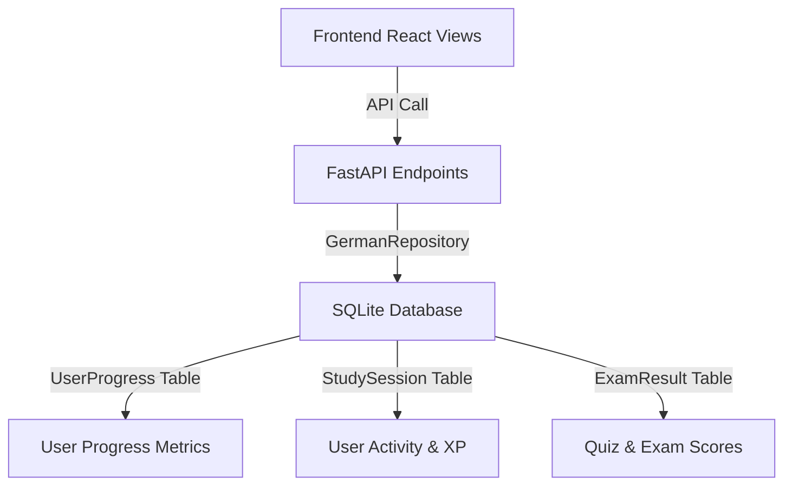

# 📊 User Progress System (Fortschrittssystem)

This document describes the design and implementation of the database-driven **User Progress System** in DeutschMastery.

---

## 🛠 Architecture Overview

The progress tracking system is completely database-driven, user-isolated, and does not rely on local storage for persistence.

---

## 💾 Database Models

### 1. `UserProgress` Table
Tracks user-specific curriculum states, level estimations, and lesson section checklists:
- `completed_lessons`: List of integers representing fully completed textbook lessons.
- `lesson_progress`: Dictionary mapping lesson numbers to completion maps of the 10 textbook sections:
  - `einstieg`, `wortschatz`, `grammatik`, `hoeren`, `lesen`, `schreiben`, `sprechen`, `quiz`, `uebungen`, `wiederholung`.
- `completed_grammar_topics`: List of completed grammar topic IDs.
- `study_streak`: Consecutive days the user has logged a study session.
- `last_study_date`: The date of the last logged study session.

### 2. `StudySession` Table
Tracks time-series logs of study sessions:
- `session_date`: Date of the session.
- `xp_earned`: XP gained during the session.
- `duration_minutes`: Duration in minutes.

---

## 🔌 API Endpoints

- **`GET /api/v1/progress`**: Retrieves the current authenticated user's progress.
- **`POST /api/v1/progress/update`**: Updates courses, CEFR levels, and goals.
- **`POST /api/v1/progress/lesson/section`**: Completes a specific section of a lesson, updating the lesson checklist and automatically advancing completed lessons.
- **`POST /api/v1/progress/log-session`**: Logs a study session, updates total XP, and recalculates the streak.
- **`GET /api/v1/progress/activity`**: Returns a 7-day time series of study sessions for the activity bar chart.
- **`POST /api/v1/grammar/{topic_id}/toggle-complete`**: Toggles a grammar topic completion in the user's progress data.

---

## 💻 Frontend Synchronization

- **Dashboard circular ring**: Renders progress dynamically from `dbData.progress_percentage`, which calculations are performed server-side as: `completed_sections / 10 * 100`.
- **Lessons Checklist**: Completions are loaded from `progress.lesson_progress[lesson_number]` and synchronized instantly with the DB on checking any tab.
- **Weekly Goal**: Evaluated dynamically by dividing the sum of `duration_minutes` of the current week from `StudySession` by `weekly_goal_hours`.
